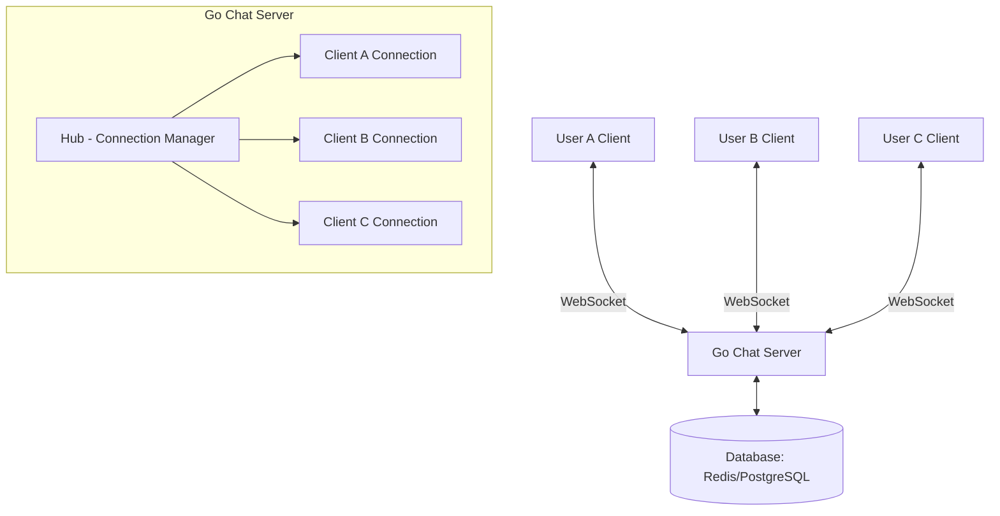
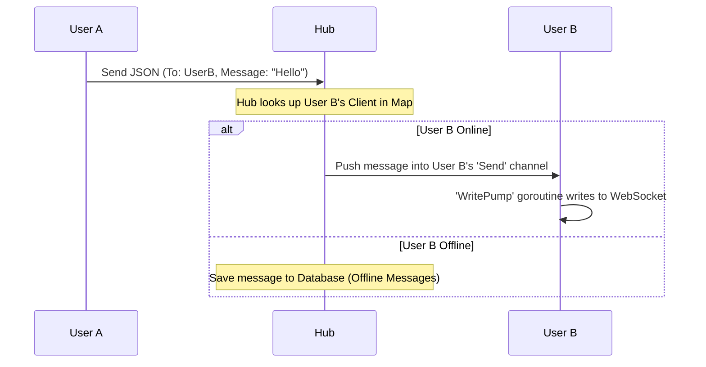
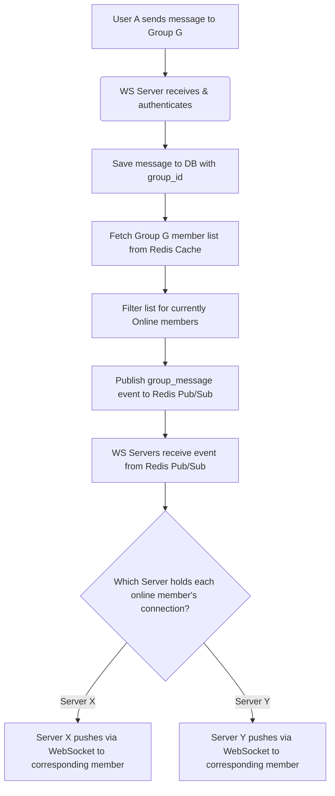
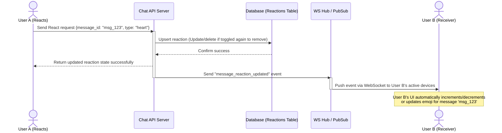
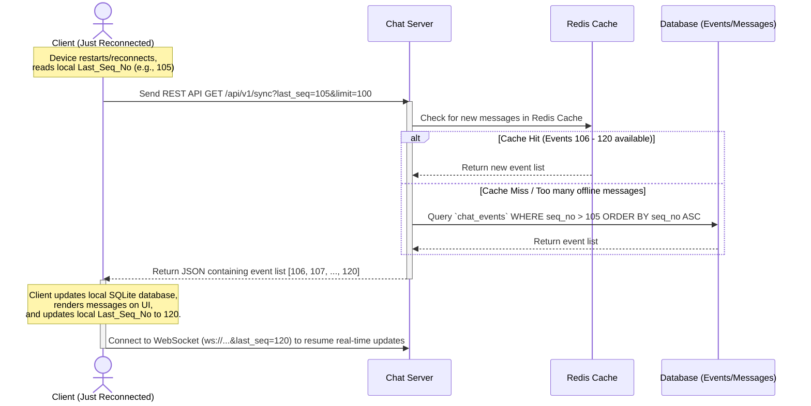

# Real-Time Chat App System Design using Go & WebSocket

This document describes the detailed architecture and design for a real-time chat system using Golang and WebSocket, serving direct user-to-user (1-1) and group messaging.

## 1. Architecture Overview

The system utilizes the popular **Hub & Spoke** model for managing WebSocket connections in Golang.



## 2. Core Components

### 2.1. Client (Browser / Mobile App)

- Opens a WebSocket connection (`ws://` or `wss://`) to the server.
- Listens for incoming events to display messages.
- Sends and receives messages formatted as JSON payloads.

### 2.2. Server (Golang)

Uses the `github.com/gorilla/websocket` library to handle connection lifecycle.
Key code entities include:

- **Client Struct:** Represents a single user's WebSocket connection.
  - Contains fields: `UserID`, pointer to `Hub`, `Conn` (WebSocket connection), and a buffered `Send` channel to push messages to this client.
  - Runs 2 background goroutines per client: `ReadPump` (listens for incoming messages sent by the user) and `WritePump` (waits for messages in the `Send` channel to write out over the WebSocket connection).
- **Hub Struct:** Central coordinator managing all active `Client` instances.
  - `Clients`: A map storing connected clients. To support 1-1 chat, the map key is typically `UserID`.
  - `Register`: Channel for registering new clients when they connect.
  - `Unregister`: Channel for unregistering clients upon disconnection or network drop.
  - `PrivateMessage`: Channel for receiving 1-1 messages and routing them to the destination `UserID`.

## 3. Data Flow

### 3.1. Connection & Authentication

1. User calls the standard HTTP login API to retrieve a JWT token.
2. User establishes a WebSocket connection: `ws://domain/ws?token=<jwt_token>`.
3. Server verifies the token and extracts the `UserID`.
4. If valid, the Server upgrades the HTTP connection to a WebSocket connection.
5. Server creates a `Client` object, assigns `UserID`, and pushes it to `Hub.Register`. The Hub saves this client in its active map.

### 3.2. Messaging Flow



## 4. Proposed Folder Structure

Adapted to your current Golang project structure:

```text
go-app/
├── cmd/
│   └── api/
│       └── main.go           # Initialize Server, Hub, and Routers
├── internal/
│   ├── chat/                 # Domain logic for WebSocket Chat
│   │   ├── client.go         # Client definition, ReadPump, WritePump
│   │   ├── hub.go            # Hub definition, Run(), Register/Unregister Client
│   │   └── message.go        # JSON Payload structs for messages
│   ├── handler/
│   │   └── websocket.go      # HTTP handler (e.g., /ws) for Connection Upgrade
│   ├── middleware/
│   │   └── auth.go           # JWT authentication middleware (HTTP & WS)
│   └── model/
│       └── user.model.go     # User model (your current schema)
├── pkg/
│   └── util/
├── go.mod
└── go.sum
```

## 5. Detailed Business Workflows

This section describes the core business workflows of the Chat system, ensuring real-time capabilities, data consistency, and optimal user experience.

### 5.1. Message Delivery Flow: Direct Chat (1-1) & Group Chat (1-N)

To ensure messages are never lost and are securely stored before distribution, the system applies a **Store and Forward** approach combined with **Message Queue / Redis Pub-Sub** for scalability.

#### A. Direct Chat Flow (1-1)

```mermaid
sequenceDiagram
    autonumber
    actor UserA as User A (Sender)
    participant WS_A as WS Server (A Connected)
    participant DB as Database & Redis
    participant PubSub as Redis Pub/Sub
    participant WS_B as WS Server (B Connected)
    actor UserB as User B (Receiver)

    UserA->>WS_A: Send WS Payload {action: "send_message", to: "UserB", content: "Hi"}
    activate WS_A
    WS_A->>DB: 1. Authenticate & Save Message (Status: Sent)
    DB-->>WS_A: Return Message ID & Timestamp
    WS_A-->>UserA: 2. ACK over WS (Confirm send success, update UI single checkmark)

    WS_A->>PubSub: 3. Publish "new_private_message" event (to: UserB)
    deactivate WS_A

    activate PubSub
    PubSub->>WS_B: 4. Broadcast event across server cluster
    deactivate PubSub

    activate WS_B
    Note over WS_B: WS Server B checks if User B<br/>is connected to it
    alt User B Online (Active Connection)
        WS_B->>UserB: 5. Push message via WS (event: "new_message")
        UserB-->>WS_B: 6. Send ACK (Delivered confirmation)
        WS_B->>DB: Update message status (Status: Delivered)
        WS_B->>PubSub: Publish "message_delivered" event to User A
        PubSub->>WS_A: Deliver "message_delivered" event
        WS_A->>UserA: Push via WS (Update UI to double checkmarks)
    else User B Offline
        Note over WS_B, UserB: B is offline; message remains in DB awaiting sync upon reconnect
    end
    deactivate WS_B
```

> [!TIP]
> **Optimization:** Instead of sending message content directly over WebSocket and waiting for DB persistence, submitting via REST API HTTP POST `/api/v1/messages` to save to DB first is a widely adopted and safe approach. It simplifies handling large file attachments (images, video) via multipart form-data. WebSocket can then focus solely on real-time event broadcasting.

#### B. Group Chat Flow (1-N)

In Group Chat, member lists can be very large. To prevent continuous database querying from causing bottlenecks:

1. The `Group Members` list is cached in a **Redis Set** (key: `group:members:<group_id>`).
2. Online status of users is centrally managed in Redis (key: `user:online_status`).



---

### 5.2. Message Recall (Delete) & Reaction Workflows

Message recall or reactions are essentially **Message State Update Events**.

#### A. Message Recall (Delete/Recall)

The system does not perform an immediate physical hard delete of the message record in the Database, preserving chat history integrity and allowing audit/reporting feature support if needed. The system applies a **Soft Delete**:

1. Update `is_deleted = true` in the `messages` collection/table in the database.
2. Update content placeholder to `"Message has been recalled"`.
3. Server broadcasts the recall event via WebSocket to all members in the conversation along with `message_id`.
4. Client receives event, finds matching message by `message_id` in local storage (Local Storage/SQLite), and updates UI display to _"Message has been recalled"_.

#### B. Message Reaction (React)

To manage reactions, a separate table/collection `message_reactions` is designed with a 1-N relation to `messages`.

**Proposed Database Schema for Reactions:**

- `message_id` (UUID, Foreign Key)
- `type_of_reaction` (String, e.g., "like", "heart", "laugh", "sad")
- `created_by` (UUID, Foreign Key)
- `created_at` (Timestamp)

**Reaction Processing Workflow:**



---

### 5.3. Multi-Device Synchronization

When a user logs in simultaneously across multiple devices (Web, Desktop, Mobile), ensuring consistent message display without state mismatch is critical.

#### A. Connection Design (1 User -> N Connections)

To support multi-device environments, the **Hub** architecture in Golang adjusts its connection mapping:

- Instead of `clients map[string]*Client` (where key is `user_id`),
- We switch to `clients map[string]map[string]*Client` (key 1 is `user_id`, key 2 is `device_id` or `connection_id`).

When a new message arrives for `User B`, the server iterates through all active connections for `User B` across all devices and pushes the message to each. Simultaneously, the message is pushed back to the sender `User A`'s other connected devices to maintain sender-side synchronization.

#### B. Offline-to-Online Synchronization (Sync Token / Sequence Number)

When a device gets disconnected (network outage, app closed) and returns online, it misses real-time events sent over WebSocket. To accurately sync message history without re-downloading the entire inbox:

##### Solution: Use **Sequence Numbers (Monotonically Increasing)** and **Version Checking**.

Whenever any event occurs in a conversation (New Message, Recall, Reaction), the Server appends that event to a change log table (`chat_events`) and generates a monotonically increasing **Sequence Number (SeqNo)** for that conversation or user.



---

## 6. Payload Design (JSON Structure)

When Client (Sender) sends a message to Server:

```json
{
  "action": "send_message",
  "to_user_id": "receiver-user-uuid",
  "content": "Hello, this is a real-time message!"
}
```

When Server routes and broadcasts a message to Client (Receiver):

```json
{
  "event": "new_message",
  "data": {
    "from_user_id": "sender-user-uuid",
    "content": "Hello, this is a real-time message!",
    "timestamp": 1698765432
  }
}
```

## 7. Future Scalability (Multi-Instance Clustering)

The architecture above performs exceptionally well on a **single Server instance**. However, when running across multiple instances (Multi-instances / Kubernetes):

- Use **Redis Pub/Sub** or **RabbitMQ**.
- **Reason:** User A connects to Server 1, User B connects to Server 2. Server 1's Hub is unaware of User B.
- **Solution:**
  - When User A sends a message to User B, Server 1 publishes the message to Redis channel `chat_messages`.
  - All Server instances subscribe to this channel.
  - When Server 2 receives the payload from Redis, it checks if User B has an active connection locally, and if so, delivers it via WebSocket.
