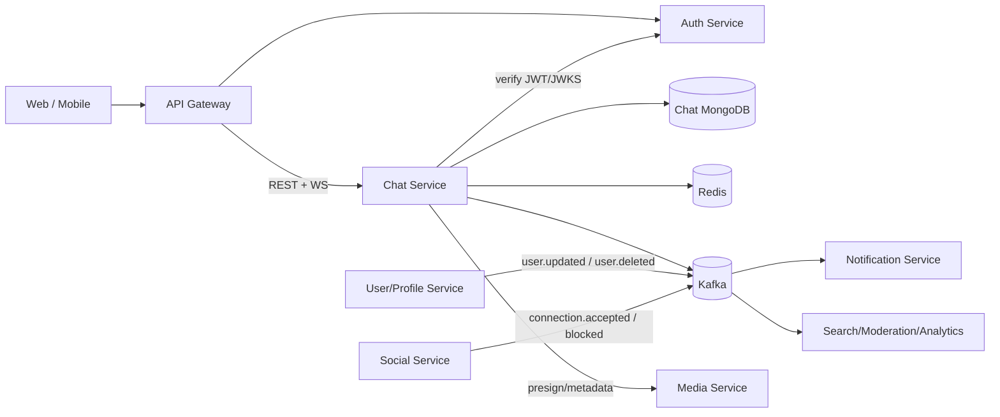
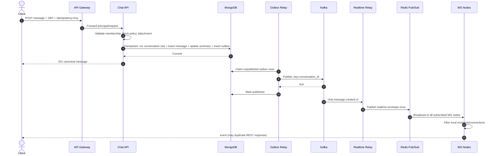
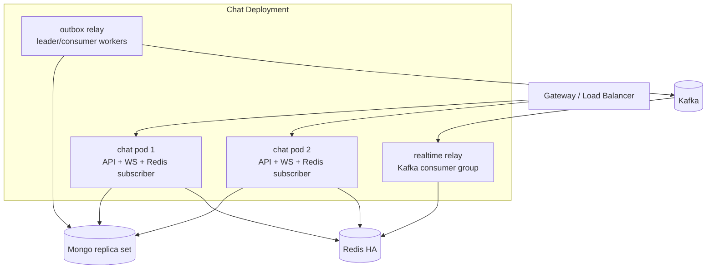

# Thiết kế refactor Chat Service cho hệ thống microservice

## Phạm vi triển khai điều chỉnh — 2026-09-10

Yêu cầu mới giới hạn runtime vào chat 1-1 và giữ cấu trúc modular hiện có (`channel/message/websocket`, controller/service/repo, `schema/dto`). Các mục bên dưới về group, Clean Architecture phân layer domain/usecase, Kafka/outbox, Redis, Media và migration nhiều phase là roadmap tham khảo, không phải phạm vi triển khai lần này.

Đã chọn Keycloak RS256 với public key nạp một lần lúc khởi động, verify hoàn toàn local và bắt buộc issuer/audience/expiry/subject/access-token type. Không gọi Keycloak để verify từng request. User ID là Keycloak `sub` dạng chuỗi. Channel chứa đúng hai participant và canonical direct key. Gửi message dùng Mongo transaction + idempotency key cấp message; realtime một replica là best-effort. Schema mới dùng database riêng, chưa tự migration dữ liệu cũ. Hướng dẫn cấu hình và API thực tế nằm trong README.md.

---

> Trạng thái: Proposed  
> Phạm vi: refactor repository `chat-service` hiện tại thành một service có thể triển khai độc lập  
> Mục tiêu: thiết kế đủ chi tiết để chia backlog và triển khai theo từng giai đoạn, không yêu cầu big-bang rewrite

## 1. Tóm tắt quyết định

Giữ Go, Gin, MongoDB, Redis, S3/MinIO và WebSocket. Bổ sung Kafka như event backbone thực tế và áp dụng transactional outbox.

Chat Service mới chỉ sở hữu:

- conversation (direct/group), membership và quyền trong conversation;
- message, reply, recall/edit, attachment reference;
- read cursor, unread projection và trạng thái ẩn/xóa lịch sử theo từng user;
- realtime session, typing và presence liên quan tới chat;
- event tích hợp đi/đến các microservice khác.

Chat Service không còn sở hữu:

- đăng ký, đăng nhập, refresh token, reset password và role toàn hệ thống;
- hồ sơ user đầy đủ;
- friend request/social graph nếu hệ thống đã có User/Social Service;
- binary file nếu hệ thống đã có Media Service.

Khuyến nghị triển khai một binary trước, nhưng giữ ranh giới module rõ ràng. Khi tải WebSocket khác tải API đáng kể, có thể chạy cùng codebase với hai mode `api` và `realtime` mà không phải viết lại domain.

## 2. Giả định và câu hỏi cần xác nhận

Thiết kế mặc định theo các giả định sau:

- Hệ thống có API Gateway và một Auth/Identity Service phát JWT.
- JWT có ít nhất `sub`, `iss`, `aud`, `exp`; `sub` là user ID ổn định.
- Kafka là message broker chung. Nếu hệ thống dùng RabbitMQ/NATS, các port trong thiết kế vẫn giữ nguyên và chỉ thay adapter.
- MongoDB được chạy dạng replica set để dùng transaction và change-safe writes.
- Một conversation có thể là direct hoặc group; lịch sử phải phân trang ổn định và hỗ trợ multi-device.
- Delivery guarantee là **at-least-once**; client và consumer phải idempotent. Không tuyên bố exactly-once end-to-end.

Các biến số cần chốt trước sprint triển khai đầu tiên:

| Câu hỏi | Mặc định trong thiết kế |
|---|---|
| Broker chung của hệ thống | Kafka |
| Auth token | JWT bất đối xứng, verify offline bằng JWKS |
| API nội bộ | REST/JSON; có thể thay bằng gRPC qua adapter |
| Multi-tenant | Có trường `tenant_id`, dùng giá trị mặc định nếu single-tenant |
| File ownership | Media Service sở hữu binary; Chat chỉ lưu metadata/reference |
| Friend request | Social/User Service sở hữu |
| Retention | Không tự xóa, cấu hình theo tenant/conversation |

## 3. Đánh giá hiện trạng repository

### 3.1. Phần có thể tái sử dụng

- Domain ban đầu đã có `channel`, `channel_members`, `messages`, unread và per-user hide/offset.
- Message history đã dùng cursor `beforeSeq`, phù hợp hơn offset pagination.
- WebSocket đã có ý tưởng multi-device: `userId -> connectionId -> client`.
- Upload đã dùng presigned URL, tránh đẩy file lớn qua WebSocket.
- Wire đã được dùng để khởi tạo dependency.

### 3.2. Các điểm chặn khi scale thành microservice

| Mức | Hiện trạng | Tác động | Hướng xử lý |
|---|---|---|---|
| P0 | User/auth/role/refresh token cùng process và cùng database | Không có ownership rõ ràng, khó deploy độc lập | Tách khỏi public surface của Chat; verify access token do Auth Service phát |
| P0 | Controller lưu Mongo rồi gọi trực tiếp in-memory WebSocket hub | Chỉ gửi được tới user nằm trên cùng replica; crash giữa save và notify làm mất event | Outbox -> Kafka -> realtime relay -> Redis Pub/Sub -> local connection registry |
| P0 | `msg_seq = UnixMilli()` | Hai message cùng millisecond có thể trùng/thứ tự không xác định | Atomic counter theo conversation trong Mongo transaction |
| P0 | Tạo group/direct channel qua nhiều insert/update không transaction | Có thể còn group không channel hoặc member không unread | Một application transaction; outbox cùng transaction |
| P0 | Nhiều endpoint nhận `user-id`/owner/requester từ body/path | Có thể thao tác thay user khác | Actor luôn lấy từ JWT `sub`; body chỉ chứa target/resource |
| P0 | WebSocket `CheckOrigin` luôn true và token có thể ở query | CSWSH, token xuất hiện trong access log/history | Origin allowlist + one-time realtime ticket |
| P0 | Hub map bị đọc/ghi từ cả event loop và method ngoài loop, nhưng lock không nhất quán | Data race, panic concurrent map access/close channel | Registry có ownership/locking thống nhất; `go test -race` bắt buộc |
| P1 | Redis presence đang dùng Hash/TTL chưa đúng mô hình; online chỉ biết local process | Presence sai khi multi-replica hoặc process chết | Key theo connection có TTL, heartbeat refresh; aggregate theo user |
| P1 | Không có Mongo indexes được quản lý trong code | Query history/member/unread suy giảm nhanh | Versioned index migration, fail startup nếu index quan trọng sai |
| P1 | Unread là mutable counter và client được phép update record theo ID | Lost update và authorization khó kiểm soát | Lưu `last_read_seq`, suy ra unread từ `last_seq - last_read_seq` hoặc projection |
| P1 | Trộn Mongo driver v1 và v2 | Mapping/error behavior không đồng nhất | Chuẩn hóa một major version |
| P1 | Global singleton chứa DB, Redis, cache, S3, hub | Test khó, lifecycle/shutdown không rõ | Constructor injection qua ports/interfaces |
| P1 | Health chỉ trả `ok` | Pod nhận traffic dù dependency chưa sẵn sàng | `/livez`, `/readyz`, `/metrics`, graceful shutdown |
| P2 | Event name/payload chưa version hóa | Client và consumer dễ vỡ khi deploy lệch phiên bản | Envelope chuẩn, schema version, compatibility policy |
| P2 | Kafka hiện chỉ là CLI demo, hard-code broker/topic | Chưa phải integration layer | Producer/consumer adapter, retry/DLQ, outbox relay |

Một số lỗi hiện trạng nên sửa ngay cả trước khi tách service:

- `channel_unread` có BSON tag `b.son:"is_active"`, khiến field không map đúng.
- `FindOneAndUpdate` ở một số repo chưa dùng `ReturnDocument=After`, response có thể là dữ liệu cũ.
- `DeleteChannelUnread` thiếu `$set` trong update document.
- `typingUsers[channelId][userId]` có thể ghi vào map con chưa được khởi tạo.
- Read/write pump chưa có deadline, protocol ping/pong, size limit và slow-consumer policy.
- Cache member 5 phút không được invalidate nhất quán khi add/remove member.

## 4. Service boundary và ownership



### 4.1. Ma trận ownership

| Dữ liệu/chức năng | Owner | Chat sử dụng bằng |
|---|---|---|
| Credential, access/refresh token | Auth Service | JWT/JWKS; không gọi auth cho mỗi request |
| Profile, avatar, display name | User Service | Event-driven local projection; fallback API có timeout |
| Friend/block relationship | Social Service | Event `connection.accepted`, `user.blocked`; policy check nội bộ |
| Conversation, membership, message | Chat Service | MongoDB riêng của Chat |
| Presence/typing | Chat Service | Redis TTL và WebSocket |
| File binary, virus scan | Media Service | `attachment_id`, signed URL/status event |
| Push/email notification | Notification Service | Consume `chat.message.created.v1` |

Không service nào được đọc trực tiếp collection của Chat. Tích hợp qua API contract hoặc event contract.

## 5. Kiến trúc bên trong Chat Service

Áp dụng ports-and-adapters nhẹ, không cần framework hóa quá mức:

```text
cmd/chat/main.go
internal/
  domain/
    conversation/
    message/
    membership/
    receipt/
  application/
    command/
    query/
    policy/
  ports/
    repositories.go
    event_publisher.go
    identity.go
    media.go
    realtime.go
  adapters/
    http/
    websocket/
    mongo/
    redis/
    kafka/
    jwks/
  platform/
    config/
    logging/
    telemetry/
    lifecycle/
migrations/mongo/
contracts/
  openapi/
  asyncapi/
  events/
```

Quy tắc dependency:

```text
transport adapter -> application use case -> domain
                                  |
                                  v
                                ports <- infrastructure adapter
```

- Controller chỉ parse/validate request, lấy principal và map response.
- Application service điều phối transaction, authorization và outbox.
- Domain không import Gin, Mongo, Redis, Kafka hay global package.
- Repo nhận `context.Context`; không tạo `context.Background()` bên trong operation.
- Error có type/code ổn định, không suy luận HTTP status từ message string.

## 6. Mô hình dữ liệu đề xuất

Giữ MongoDB để giảm rủi ro migration. Trong giai đoạn đầu giữ ObjectID và expose dưới dạng opaque string. Không đổi ID sang UUID chỉ vì tách service.

### 6.1. `conversations`

```json
{
  "_id": "ObjectId",
  "tenant_id": "default",
  "type": "direct|group",
  "direct_key": "minUserId:maxUserId",
  "title": "Team A",
  "avatar_attachment_id": null,
  "owner_id": "user-id",
  "last_seq": 1842,
  "last_message_id": "ObjectId",
  "last_message_at": "date",
  "status": "active|archived|deleted",
  "version": 7,
  "created_at": "date",
  "updated_at": "date"
}
```

- Unique partial index `(tenant_id, direct_key)` cho direct chat.
- `last_seq` được `$inc` atomically trong transaction tạo message.
- Không dùng `participant_ids` làm source of truth; membership collection là source of truth.

### 6.2. `conversation_members`

```json
{
  "_id": "ObjectId",
  "tenant_id": "default",
  "conversation_id": "ObjectId",
  "user_id": "external-user-id",
  "role": "owner|admin|member",
  "status": "active|left|kicked|blocked",
  "joined_seq": 0,
  "left_seq": null,
  "joined_at": "date",
  "updated_at": "date"
}
```

Membership history được giữ lại để quyết định user được xem message từ thời điểm nào. Unique index `(tenant_id, conversation_id, user_id)`.

### 6.3. `messages`

```json
{
  "_id": "ObjectId",
  "tenant_id": "default",
  "conversation_id": "ObjectId",
  "seq": 1842,
  "sender_id": "external-user-id",
  "client_message_id": "01J...",
  "type": "text|image|file|system",
  "content": "hello",
  "attachments": [
    {"attachment_id": "...", "name": "a.png", "mime": "image/png", "size": 12001}
  ],
  "reply_to_message_id": null,
  "revision": 1,
  "recalled_at": null,
  "created_at": "date",
  "updated_at": "date"
}
```

Unique indexes:

- `(tenant_id, conversation_id, seq)`;
- `(tenant_id, sender_id, client_message_id)` để chống gửi lặp khi retry.

Không dùng một field `status` chung trên message để biểu diễn delivered/read cho cả group. Delivery/read là trạng thái theo user/device hoặc read cursor.

### 6.4. `user_conversation_states`

```json
{
  "tenant_id": "default",
  "conversation_id": "ObjectId",
  "user_id": "external-user-id",
  "last_delivered_seq": 1839,
  "last_read_seq": 1820,
  "hidden_before_seq": 0,
  "muted_until": null,
  "pinned_at": null,
  "archived_at": null,
  "version": 11,
  "updated_at": "date"
}
```

Unique index `(tenant_id, user_id, conversation_id)`. Update read cursor bằng `$max`, vì cursor chỉ được tiến về phía trước. Unread cơ bản là `max(0, conversation.last_seq - state.last_read_seq)`; nếu system message không tính unread thì duy trì projection có điều kiện.

### 6.5. Các collection phụ

- `message_visibility`: hide một message cho một user, unique `(user_id, message_id)`.
- `message_reactions`: unique `(message_id, user_id, reaction)` hoặc `(message_id, user_id)` tùy UX.
- `outbox_events`: event nằm cùng transaction với aggregate mutation.
- `inbox_events`: event external đã xử lý, unique `event_id` để consumer idempotent.
- `user_snapshots`: projection tối thiểu `{user_id, display_name, avatar_ref, status, version}`; không copy email/role không cần thiết.

### 6.6. Index bắt buộc

```javascript
conversations:             { tenant_id: 1, direct_key: 1 } unique partial
conversations:             { tenant_id: 1, last_message_at: -1 }
conversation_members:      { tenant_id: 1, user_id: 1, status: 1, conversation_id: 1 }
conversation_members:      { tenant_id: 1, conversation_id: 1, user_id: 1 } unique
messages:                  { tenant_id: 1, conversation_id: 1, seq: -1 } unique
messages:                  { tenant_id: 1, sender_id: 1, client_message_id: 1 } unique
user_conversation_states:  { tenant_id: 1, user_id: 1, conversation_id: 1 } unique
message_visibility:        { tenant_id: 1, user_id: 1, message_id: 1 } unique
outbox_events:             { status: 1, next_attempt_at: 1, created_at: 1 }
outbox_events:             { published_at: 1 } TTL theo retention
inbox_events:              { event_id: 1 } unique
inbox_events:              { processed_at: 1 } TTL theo retention
```

## 7. Public API v1

Base path đề xuất: `/api/v1/chat`. Gateway là nơi expose public domain; service có thể nhận path đã strip prefix.

| Method | Path | Ý nghĩa |
|---|---|---|
| `POST` | `/conversations/direct` | Get-or-create direct conversation với `target_user_id` |
| `POST` | `/conversations` | Tạo group conversation |
| `GET` | `/conversations?cursor=&limit=` | Inbox của actor |
| `GET` | `/conversations/{id}` | Chi tiết conversation |
| `PATCH` | `/conversations/{id}` | Đổi tên/avatar/settings có kiểm quyền |
| `DELETE` | `/conversations/{id}` | Archive/delete theo policy |
| `POST` | `/conversations/{id}/members` | Add member |
| `DELETE` | `/conversations/{id}/members/{userId}` | Leave/kick member |
| `GET` | `/conversations/{id}/members?cursor=` | Danh sách member |
| `POST` | `/conversations/{id}/messages` | Gửi message |
| `GET` | `/conversations/{id}/messages?before_seq=&limit=` | Lịch sử message |
| `PATCH` | `/messages/{id}` | Edit message |
| `POST` | `/messages/{id}/recall` | Recall idempotent |
| `PUT` | `/conversations/{id}/read-cursor` | Advance `last_read_seq` |
| `PUT` | `/messages/{id}/visibility` | Hide for me |
| `PUT` | `/messages/{id}/reactions/{reaction}` | Upsert reaction |
| `DELETE` | `/messages/{id}/reactions/{reaction}` | Remove reaction |
| `POST` | `/realtime-ticket` | Lấy ticket WebSocket một lần, TTL ngắn |
| `GET` | `/sync?cursor=&limit=` | Catch-up event sau reconnect nếu cần global sync |

Các nguyên tắc contract:

- Actor ID luôn từ verified JWT `sub`, không nhận `requester_id`, `owner_id` hay `from_id` từ client.
- Mọi command tạo resource nhận header `Idempotency-Key`; gửi message còn nhận `client_message_id` do client sinh.
- Cursor là opaque base64 token hoặc sequence; không dùng page number.
- Tất cả timestamp là UTC RFC3339; server là nguồn thời gian.
- Error envelope ổn định: `code`, `message`, `details`, `trace_id`.
- `409` cho idempotency conflict/version conflict; `403` cho policy; `404` có thể dùng để không lộ resource.

Ví dụ gửi message:

```http
POST /api/v1/chat/conversations/65f.../messages
Authorization: Bearer <access-token>
Idempotency-Key: 01JABC...
Content-Type: application/json

{
  "client_message_id": "01JABC...",
  "type": "text",
  "content": "Xin chào",
  "reply_to_message_id": null,
  "attachment_ids": []
}
```

Response `201` trả message canonical có `id`, `seq`, `created_at`. Retry cùng key và cùng payload trả cùng kết quả; cùng key nhưng payload khác trả `409 IDEMPOTENCY_CONFLICT`.

## 8. Event contract

### 8.1. Envelope chung

```json
{
  "event_id": "01J...",
  "event_type": "chat.message.created.v1",
  "occurred_at": "2026-09-09T12:30:00Z",
  "producer": "chat-service",
  "tenant_id": "default",
  "aggregate_type": "conversation",
  "aggregate_id": "65f...",
  "aggregate_version": 1842,
  "correlation_id": "trace-or-request-id",
  "causation_id": null,
  "data": {}
}
```

`event_id` dùng để dedupe; `aggregate_version`/`seq` dùng để reorder trong một conversation. Consumer không được dựa vào thứ tự toàn cục.

### 8.2. Topic và key

| Topic | Partition key | Producer | Consumer chính |
|---|---|---|---|
| `chat.conversation.events.v1` | `conversation_id` | Chat | Notification, Search, Analytics, realtime relay |
| `chat.presence.events.v1` | `user_id` | Chat | User/Notification nếu thực sự cần |
| `identity.user.events.v1` | `user_id` | User | Chat user projection |
| `social.connection.events.v1` | canonical user pair | Social | Chat direct-conversation policy |
| `media.attachment.events.v1` | `attachment_id` | Media | Chat attachment state |

Event Chat phát ra tối thiểu:

- `chat.conversation.created.v1`
- `chat.conversation.updated.v1`
- `chat.member.added.v1`, `chat.member.removed.v1`
- `chat.message.created.v1`, `chat.message.edited.v1`, `chat.message.recalled.v1`
- `chat.message.reaction-updated.v1`
- `chat.read-cursor.advanced.v1`

Không đưa presigned URL hoặc PII không cần thiết vào event. URL download được tạo khi client cần.

### 8.3. Compatibility

- Add field optional là backward compatible.
- Rename/remove/change semantic phải tạo event/API version mới.
- JSON Schema/AsyncAPI được lưu trong `contracts/` và kiểm bằng CI.
- Giữ tối thiểu hai phiên bản consumer trong thời gian rollout lệch phiên bản.

## 9. Luồng gửi message tin cậy



Quan trọng:

- Message phải **commit trước** khi được realtime hóa.
- Relay có thể publish lặp nếu crash sau Kafka ack trước khi mark outbox. Consumer/client dedupe bằng `event_id` hoặc `message_id`.
- Kafka giữ thứ tự theo `conversation_id`; WebSocket vẫn có thể reconnect/miss nên client dùng `seq` để phát hiện gap và gọi history/sync.
- Không dùng Redis Pub/Sub làm nguồn dữ liệu bền vững.

## 10. Realtime và presence

### 10.1. Kết nối

1. Client gọi `POST /realtime-ticket` bằng access token.
2. Chat phát ticket opaque, single-use, TTL 30 giây, bind với `user_id`, `device_id`, tenant và token expiry.
3. Client kết nối `wss://.../api/v1/chat/ws?ticket=...`.
4. WS node consume ticket atomically, kiểm Origin allowlist và đăng ký connection.

Lý do dùng ticket: browser WebSocket không cho tùy ý set `Authorization` header, còn access token trong query dễ lọt vào log. Query chỉ chứa ticket dùng một lần và hết hạn nhanh.

### 10.2. Protocol envelope

```json
{
  "event_id": "01J...",
  "type": "chat.message.created.v1",
  "conversation_id": "65f...",
  "seq": 1842,
  "server_time": "2026-09-09T12:30:00Z",
  "data": {}
}
```

Client-to-server chỉ dùng cho ephemeral action (`typing.start`, `typing.stop`, protocol ack/ping). Durable command như gửi/edit/recall message ưu tiên REST để có idempotency, status code, timeout và retry rõ ràng.

### 10.3. Registry và fan-out

- Mỗi WS node giữ local registry `user_id -> connection_id -> connection`.
- Mỗi node subscribe Redis channel `chat:realtime:v1` hoặc node-specific channels ở quy mô lớn.
- Realtime relay consume Kafka bằng một consumer group, publish mỗi event một lần sang Redis.
- Tất cả node nhận event rồi chỉ push tới user đang kết nối local.
- Slow consumer: send buffer hữu hạn; khi đầy, đóng connection bằng code rõ ràng và buộc client reconnect/sync. Không block fan-out loop.

### 10.4. Heartbeat/presence

- Protocol ping mỗi 25 giây, pong deadline 10 giây; reverse proxy idle timeout phải lớn hơn heartbeat.
- Redis key `presence:conn:{connection_id}` = `{user_id,node_id,device_id}` TTL 60 giây.
- Refresh TTL khi nhận pong; delete best-effort khi disconnect.
- Online user được suy ra khi còn ít nhất một connection key sống.
- Typing TTL 3-5 giây, không ghi Mongo/Kafka trừ khi có yêu cầu analytics rõ ràng.

Presence là eventually consistent. Không dùng presence để quyết định có lưu/gửi message hay không.

## 11. Consistency, concurrency và failure policy

### 11.1. Transaction boundary

Các operation phải transaction:

- create group conversation + owner member + owner state + outbox;
- get-or-create direct conversation + two members + states + outbox;
- create message + sequence + conversation summary + outbox;
- add/remove member + state + outbox.

Mongo transaction yêu cầu replica set. Nếu chưa thể bật replica set, giai đoạn chuyển tiếp phải dùng idempotent saga + repair job và không tuyên bố strong consistency.

### 11.2. Idempotency

- Public commands: `Idempotency-Key` scoped theo `(tenant, actor, route)`.
- Message: unique `(sender_id, client_message_id)`.
- Incoming event: unique `event_id` trong inbox.
- Read cursor: `$max(last_read_seq, requested_seq)`.
- Direct chat: unique canonical `direct_key`.
- Add member/reaction/recall: upsert hoặc state transition có precondition.

### 11.3. Retry và DLQ

- HTTP downstream: timeout ngắn, exponential backoff chỉ với operation idempotent, circuit breaker.
- Kafka consumer: retry có giới hạn; lỗi poison/schema vào DLQ kèm reason, original topic/partition/offset.
- Outbox: claim lease, backoff, `attempt_count`, alert khi event quá tuổi SLO.
- Redis lỗi không làm mất durable command; realtime chậm và client catch up qua API.

## 12. Authentication, authorization và bảo mật

### 12.1. Authentication

- Gateway có thể verify token, nhưng Chat vẫn verify signature/claims hoặc tin header principal chỉ khi mTLS và gateway identity được bảo đảm.
- Khuyến nghị JWT RS256/ES256 + JWKS cache; validate chính xác `alg`, `iss`, `aud`, `exp`, `nbf`.
- Không dùng shared HS256 secret giữa nhiều service.
- Service-to-service dùng mTLS/workload identity hoặc client credentials, không giả user bằng header public.

### 12.2. Authorization

Mỗi use case kiểm policy trong service:

- xem/gửi message: active member và `seq >= joined_seq`;
- edit/recall: sender hoặc moderator theo policy, có time window nếu nghiệp vụ yêu cầu;
- add/kick member: owner/admin và không vượt tenant limit;
- read/hide: actor chỉ cập nhật state của chính mình;
- attachment: attachment thuộc actor, scan passed, chưa attach nơi khác nếu policy cấm.

### 12.3. Hardening

- Origin allowlist cho WebSocket; TLS ở gateway/load balancer.
- Giới hạn message text, JSON frame, attachment count/size và rate theo user + IP + conversation.
- Log không chứa token, full message content, presigned URL hay PII.
- Encode/sanitize ở client; backend vẫn validate UTF-8/type/length.
- Retention, legal delete và audit phải có policy riêng; recall không đồng nghĩa hard delete.
- Secret lấy từ secret manager/Kubernetes Secret, không commit hoặc log.

## 13. Deployment topology



Ban đầu relay có thể chạy background trong mỗi pod bằng lease/consumer group. Khi cần scale hoặc deploy độc lập, bật command mode riêng:

```text
chat serve --mode=api-realtime
chat worker --mode=outbox
chat worker --mode=realtime-relay
chat worker --mode=projection
```

Kubernetes/runtime requirements:

- readiness phụ thuộc Mongo và khả năng nhận request; Kafka/Redis degradation được thể hiện riêng tùy endpoint;
- liveness chỉ kiểm process/event loop, không phụ thuộc external dependency;
- graceful shutdown: stop accepting connection, drain HTTP, close WS với reconnect hint, stop consumer và release lease;
- PodDisruptionBudget, resource requests/limits và autoscale theo CPU + active connections + event lag;
- không cần sticky session vì mọi WS connection đã sống trên một pod và fan-out cross-pod qua Redis.

## 14. Observability và SLO khởi điểm

### 14.1. Correlation

Truyền `trace_id`, `correlation_id`, `event_id`, `conversation_id` (hashed nếu cần) qua HTTP -> outbox -> Kafka -> realtime. Dùng OpenTelemetry traces, Prometheus metrics và structured logs.

### 14.2. Metrics tối thiểu

- HTTP rate/error/duration theo route/status, không label bằng user/conversation ID.
- Active WS connections/users, connect/disconnect reason, buffer saturation.
- Message command latency và error theo code.
- Mongo operation/transaction latency và pool saturation.
- Outbox pending count/oldest age/retry/failure.
- Kafka consumer lag, retry và DLQ count.
- Redis publish/subscriber errors và presence key count.
- Realtime latency từ `occurred_at` đến socket write.

SLO khởi điểm để thảo luận, chưa phải cam kết nếu chưa có load model:

| Chỉ số | Mục tiêu ban đầu |
|---|---|
| API availability | 99.9% / tháng |
| Send message p95 | < 300 ms trong cùng region |
| Event tới online recipient p95 | < 1 s sau commit |
| Outbox oldest unpublished | < 30 s bình thường |
| Durable message loss | 0 sau response `201` |

## 15. Chiến lược migration không downtime

### Phase 0 — Baseline và safety net

- Chốt API/event ownership với Auth, User, Social, Media và Gateway.
- Bổ sung characterization/integration tests cho create direct/group, send/history, recall, membership, read cursor.
- Bật `go test -race`, lint, dependency scan; bổ sung load test WS/message.
- Đo baseline latency, message rate, concurrent connections và kích thước collection.

Exit: có test chống regression và dashboard baseline.

### Phase 1 — Modularize trong cùng binary

- Tạo domain/application/ports/adapters; bỏ dần `global.*` khỏi nghiệp vụ.
- Chuẩn hóa Mongo driver, context, typed error, config và graceful shutdown.
- Giữ route cũ qua compatibility adapter; route mới `/api/v1/chat` chạy song song.
- Sửa P0 data race/authz/sequence và thêm versioned indexes.

Exit: cùng chức năng, contract test pass, không còn controller gọi hub trực tiếp.

### Phase 2 — Reliable events và multi-replica realtime

- Thêm outbox collection, Kafka producer/consumer, schema và DLQ.
- Event hóa message/member/conversation; realtime nhận từ event pipeline.
- Thêm Redis cross-node fan-out, ticket handshake, heartbeat và reconnect sync.
- Chạy ít nhất hai replica trong staging, test chaos kill pod/Redis/Kafka.

Exit: kill pod sau Mongo commit không mất event; user ở hai pod vẫn nhận message.

### Phase 3 — Tách identity/social/media

- Chat verify token Auth Service; dừng phát token và bỏ public auth/user/role routes khỏi Chat.
- Consume user projection; không join/read database User Service.
- Direct conversation được mở theo policy/event từ Social Service.
- Upload route chuyển sang Media Service hoặc giữ adapter có deprecation header trong một release window.

Exit: Chat deploy được khi không có schema/collection user/auth local; không DB sharing.

### Phase 4 — Data migration và traffic cutover

- Backfill `channels/groups/channel_members/messages` sang schema mới bằng job có checkpoint.
- Dùng deterministic mapping giữ ID cũ; ghi migration audit/count/checksum.
- Trong cửa sổ chuyển tiếp: dual-read có feature flag; tránh dual-write tay, ưu tiên CDC/outbox bridge.
- Shadow read và so sánh response; canary tenant/user; tăng dần traffic tại gateway.
- Giữ route cũ trả deprecation/sunset header rồi mới remove.

Exit: reconciliation không lệch, rollback gateway đã diễn tập, old writer bị khóa.

### Phase 5 — Hardening và tối ưu theo số liệu

- Load/soak test, tune pool/buffer/partition, autoscaling.
- Archive/retention, moderation, search projection nếu có requirement.
- Xóa compatibility code và collection cũ sau retention/rollback window.

## 16. Mapping dữ liệu hiện tại sang mô hình mới

| Hiện tại | Mới | Ghi chú |
|---|---|---|
| `channels` + `groups` | `conversations` | Merge metadata group; direct giữ canonical pair key |
| `channel_members` | `conversation_members` | Giữ role/status/time; bổ sung joined/left seq |
| `messages.msg_seq` | `messages.seq` | Backfill thứ tự theo `(old msg_seq, created_at, _id)` rồi đánh lại seq liên tục nếu có collision |
| `channel_unread` | `user_conversation_states` | Map read position nếu suy ra được; không tin tuyệt đối mutable unread count |
| `message_offsets.offset` | `hidden_before_seq` | Theo user + conversation |
| `message_extras` | `message_visibility` | Dedupe trước khi tạo unique index |
| `message_reactions` | `message_reactions` | Thêm unique index và updated_at |
| `users`, `roles`, `refresh_tokens` | Không nằm trong Chat DB | User projection chỉ chứa field phục vụ UI chat |
| `connections` | Social Service | Chat chỉ giữ link/policy cần thiết hoặc direct key |

Backfill phải tạo báo cáo:

- tổng record nguồn/đích theo collection và tenant;
- orphan message/member/channel;
- duplicate direct conversation/member/client key;
- collision sequence;
- sample checksum và query parity.

## 17. Testing strategy

- Unit: domain rules, policy, state transition, idempotency.
- Repository integration: Mongo thật bằng container/replica set; unique index và transaction.
- Contract: OpenAPI request/response; JSON Schema/AsyncAPI producer-consumer compatibility.
- Component: HTTP -> Mongo/outbox; Kafka -> Redis -> fake WebSocket connection.
- Race: hub/registry connect-disconnect-send đồng thời với `go test -race`.
- Resilience: kill pod sau commit, Kafka unavailable, Redis restart, duplicate/out-of-order event.
- Load: concurrent WS, fan-out group, history pagination, hot conversation.
- Security: horizontal privilege escalation, forged actor IDs, expired/wrong-audience JWT, Origin, oversized frame, rate limit.

Các invariant phải test:

1. Một conversation không có hai message cùng `seq`.
2. Response `201` đồng nghĩa message và outbox đã commit.
3. Retry cùng `client_message_id` không tạo message thứ hai.
4. User ngoài conversation không đọc/gửi/typing được.
5. Read cursor không lùi.
6. Event lặp không làm projection/reaction/unread tăng hai lần.
7. Reconnect từ `last_seq` không mất message dù realtime event bị miss.

## 18. Backlog triển khai đề xuất

### Epic A — Foundation

- A1 config validation, lifecycle và health endpoints;
- A2 typed errors/response envelope/request ID;
- A3 Mongo adapter + versioned index migration;
- A4 remove global dependencies khỏi một vertical slice `send message`;
- A5 CI test/race/lint/contracts.

### Epic B — Conversation/message core

- B1 conversation/member aggregate và repository;
- B2 atomic sequence + create message transaction;
- B3 history/read cursor/hide/reaction;
- B4 authorization policy và idempotency store;
- B5 compatibility routes/mappers.

### Epic C — Eventing/realtime

- C1 outbox + relay + retry/DLQ;
- C2 versioned event schemas;
- C3 Kafka-to-Redis realtime relay;
- C4 safe WS registry, heartbeat, ticket, slow-client handling;
- C5 sync/gap recovery + multi-device tests.

### Epic D — Microservice integration

- D1 Auth/JWKS + service identity;
- D2 User projection consumer;
- D3 Social policy/events;
- D4 Media adapter;
- D5 Gateway routing/canary/deprecation.

### Epic E — Migration/operations

- E1 backfill/reconciliation tooling;
- E2 dashboards/alerts/SLO;
- E3 load/chaos/security tests;
- E4 production canary/rollback runbook;
- E5 remove legacy ownership/data.

## 19. Definition of Done cho phiên bản Chat Service đầu tiên

- Service deploy độc lập và không đọc database của service khác.
- Auth/user/role/refresh-token endpoint không còn được expose từ Chat.
- Send message transactionally tạo message + outbox, có idempotency.
- Hai replica bất kỳ đều realtime được cho user multi-device.
- Reconnect phát hiện gap và lấy lại dữ liệu bền vững.
- Authorization test chặn toàn bộ horizontal privilege escalation đã liệt kê.
- Mongo indexes được quản lý/version hóa và production query có explain plan đạt yêu cầu.
- Có OpenAPI, event schemas, dashboard, alerts, runbook và rollback procedure.
- `go test ./...`, integration tests và `go test -race ./...` pass trong CI.
- Chaos case: kill pod sau commit, Redis restart, Kafka retry không làm mất durable message.

## 20. ADR ngắn gọn

### ADR-001 — REST command, WebSocket delivery

Durable mutation đi qua REST; WebSocket dùng cho server push và ephemeral signal. Quyết định này làm retry/idempotency/observability đơn giản hơn và tránh gửi file qua socket.

### ADR-002 — MongoDB tiếp tục là source of truth

Không đổi database trong cùng đợt tách service. Rủi ro chính hiện tại là ownership, consistency và delivery, không phải loại database.

### ADR-003 — Kafka bền vững, Redis tạm thời

Kafka mang integration/domain event; Redis phục vụ fan-out/presence/cache. Mất Redis có thể làm chậm realtime nhưng không được làm mất message.

### ADR-004 — At-least-once + idempotency

Chấp nhận event có thể lặp. Exactly-once xuyên HTTP, Mongo, Kafka, Redis và thiết bị là cam kết không thực tế; dedupe rõ ràng đáng tin cậy hơn.

### ADR-005 — Modular service trước khi tách process realtime

Một codebase/binary giảm chi phí vận hành ban đầu. API và realtime chỉ tách deployment khi metrics cho thấy cần scale/lifecycle độc lập.
