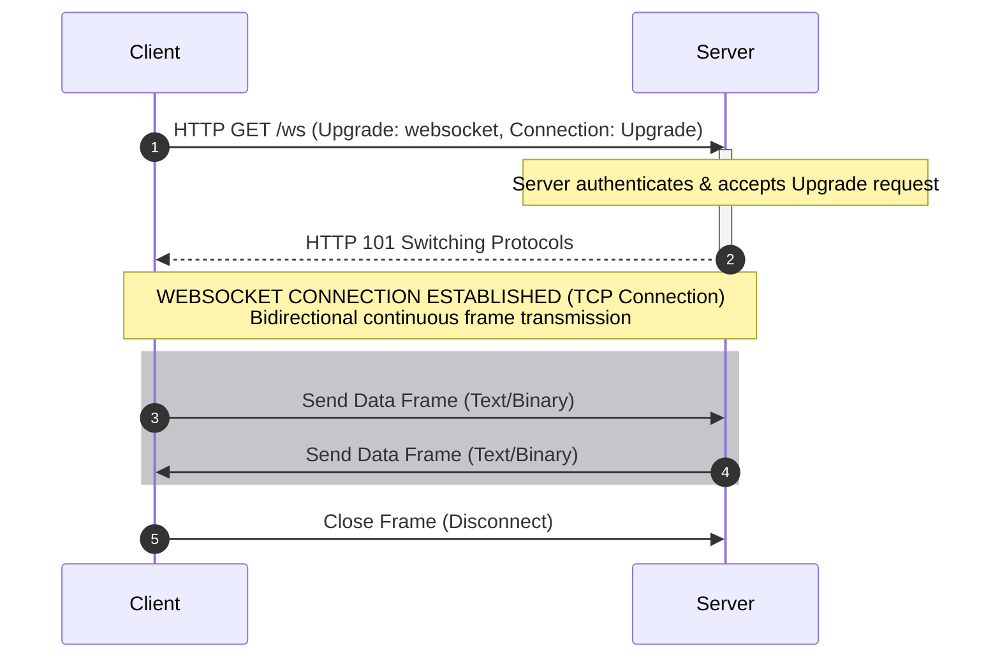
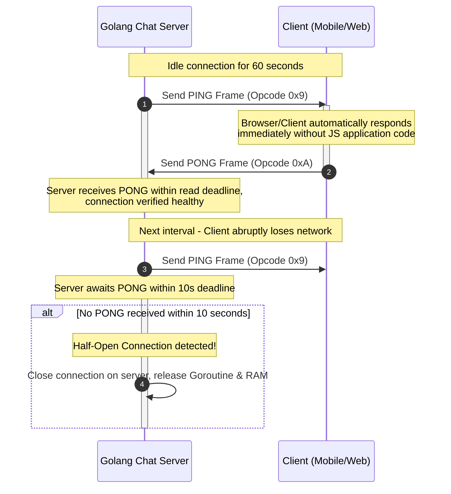
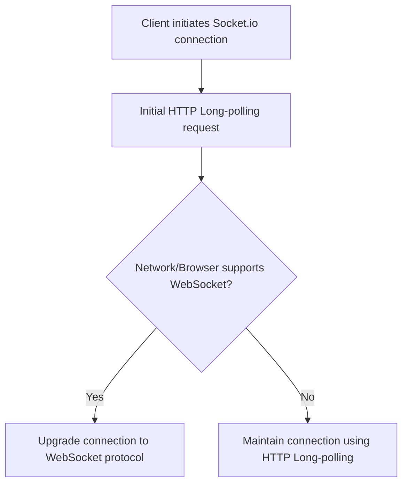

# Understanding Raw WebSocket & Comparison with Socket.io

This document provides a detailed technical overview of the **Raw WebSocket protocol (RFC 6455)**, its underlying mechanics, and an in-depth comparison with the popular **Socket.io** library for real-time applications.

---

## 1. What is Raw WebSocket?

**WebSocket** is a standardized, full-duplex, bidirectional communication protocol over a single **TCP** connection. Standardized by the IETF in **RFC 6455**, it is natively supported by virtually all modern web browsers through the Web IDL `WebSocket` API.



---

### 1.1. Handshake Details (HTTP Upgrade)

Although WebSocket operates on an entirely distinct protocol once established, the initial connection handshake must start via a standard **HTTP GET Upgrade** request. This allows WebSocket traffic to leverage existing HTTP infrastructure (ports 80/443), seamlessly passing through reverse proxies and firewalls.

#### A. Client Request (HTTP GET Upgrade)

To initiate a connection, the Client sends a standard **HTTP GET request** containing specific mandatory headers:

```http
GET /websocket HTTP/1.1
Host: server.example.com
Upgrade: websocket
Connection: Upgrade
Sec-WebSocket-Key: dGhlIHNhbXBsZSBub25jZQ==
Sec-WebSocket-Version: 13
Origin: http://example.com
```

- `Upgrade: websocket` & `Connection: Upgrade`: Requests the server to upgrade the connection protocol from HTTP/1.1 to WebSocket.
- `Sec-WebSocket-Key`: A random 16-byte Base64-encoded string used to verify server protocol compliance and prevent cached HTTP responses from misidentifying WebSocket handshakes.
- `Sec-WebSocket-Version`: Indicates the WebSocket protocol version (version 13 is standard).
- `Origin`: Protects against **Cross-Site WebSocket Hijacking (CSWSH)** by allowing the server to validate the origin of the script initiating the connection.

#### B. Server Response (HTTP 101 Switching Protocols)

If the server approves the upgrade, it responds with status code `101`:

```http
HTTP/1.1 101 Switching Protocols
Upgrade: websocket
Connection: Upgrade
Sec-WebSocket-Accept: s3pPLMBiTxaQ9kYGzzhZRbK+xOo=
```

#### C. Cryptographic Calculation of `Sec-WebSocket-Accept`

To prove to the client that the server understands the WebSocket protocol (and isn't merely a proxy caching standard HTTP responses), the server computes `Sec-WebSocket-Accept` using the following cryptographic procedure:

1. Retrieve the `Sec-WebSocket-Key` value sent by the Client (e.g., `dGhlIHNhbXBsZSBub25jZQ==`).
2. Concatenate it with a globally standardized **Magic String UUID**: `"258EAFA5-E914-47DA-95CA-C5AB0DC85B11"`.
   - Concatenated string: `dGhlIHNhbXBsZSBub25jZQ==258EAFA5-E914-47DA-95CA-C5AB0DC85B11`
3. Compute the **SHA-1** hash of the concatenated string (yielding a 20-byte binary digest).
4. **Base64** encode the resulting SHA-1 binary digest to produce the final challenge response.

```
Example calculation:
Sec-WebSocket-Key:    "dGhlIHNhbXBsZSBub25jZQ=="
Magic String UUID:    "258EAFA5-E914-47DA-95CA-C5AB0DC85B11"
Concatenation:        "dGhlIHNhbXBsZSBub25jZQ==258EAFA5-E914-47DA-95CA-C5AB0DC85B11"
SHA-1 Hash (Hex):     b37a4f2cc0624f1690f64606cf385945b2bec4ea
Base64 Encode:        "s3pPLMBiTxaQ9kYGzzhZRbK+xOo="  <-- Matches Sec-WebSocket-Accept exactly
```

---

### 1.2. Binary Frame Structure (RFC 6455 Section 5.2)

Unlike HTTP which transmits textual data, WebSocket packetizes transmitted data into compact binary units known as **Frames**. Understanding the bit-level structure of a WebSocket Frame is essential for network optimization.

Below is the standard bit layout of a RFC 6455 WebSocket Frame:

```text
 0                   1                   2                   3
 0 1 2 3 4 5 6 7 8 9 0 1 2 3 4 5 6 7 8 9 0 1 2 3 4 5 6 7 8 9 0 1
+-+-+-+-+-------+-+-------------+-------------------------------+
|F|R|R|R| opcode|M| Payload len |    Extended payload length    |
|I|S|S|S|  (4b) |A|     (7b)    |             (16/64)           |
|N|V|V|V|       |S|             |   (if payload len==126/127)   |
| |1|2|3|       |K|             |                               |
+-+-+-+-+-------+-+-------------+-------------------------------+
|     Extended payload length continued, if payload len == 127  |
+-------------------------------+-------------------------------+
|                               |Masking-key, if MASK set to 1  |
+-------------------------------+-------------------------------+
| Masking-key (continued)       |          Payload Data         |
+-------------------------------- - - - - - - - - - - - - - - - +
:                     Payload Data continued ...                :
+---------------------------------------------------------------+
```

#### Detailed Field Breakdown:

1. **FIN (1 bit):** Short for _Final_. If set to `1`, this frame is the final frame of the message. If set to `0`, the message is incomplete and subsequent continuation frames follow (enabling streaming of large data payloads).
2. **RSV1, RSV2, RSV3 (1 bit each):** Reserved for protocol extensions (such as the `permessage-deflate` compression algorithm). Must be `0` unless an extension is negotiated.
3. **Opcode (4 bits):** Defines the interpretation of the Payload Data:
   - `0x0`: Continuation Frame (continues a fragmented message).
   - `0x1`: Text Frame (UTF-8 encoded string).
   - `0x2`: Binary Frame (raw binary data, e.g., files, audio, video).
   - `0x8`: Connection Close (Control frame requesting connection termination).
   - `0x9`: Ping (Control frame testing connection vitality).
   - `0xA`: Pong (Control frame responding to Ping).
4. **MASK (1 bit):** Indicates whether the payload data is masked (XOR encrypted).
   - **MANDATORY FOR CLIENT:** All frames sent from **Client to Server MUST have MASK = 1** and include a 4-byte `Masking-key`. Unmasked client frames must result in immediate connection closure by the server.
   - **MANDATORY FOR SERVER:** All frames sent from **Server to Client MUST have MASK = 0** (unmasked).
5. **Payload Length (7 bits, 7+16 bits, or 7+64 bits):** Indicates payload length:
   - If length $\le 125$ bytes: Stored directly in the 7-bit field.
   - If length is between $126$ and $65535$ bytes: The 7-bit field holds `126` ($0x7E$), and the next 16 bits contain the unsigned integer length.
   - If length $> 65535$ bytes: The 7-bit field holds `127` ($0x7F$), and the next 64 bits (8 bytes) contain the unsigned integer length.
6. **Masking-key (0 or 4 bytes):** Present if MASK bit = 1. A random 4-byte key chosen by the client to XOR mask the payload.

---

### 1.3. Client XOR Masking & Proxy Security

A common question when learning WebSocket protocol details: **Why must Clients mask messages sent to the Server, while Server frames remain unmasked?**

#### A. Security Rationale: Preventing Cache Poisoning Attacks

If clients were allowed to send unmasked raw data, a malicious script running in a user's browser could forge binary WebSocket frames crafted to resemble valid HTTP requests. If routed through legacy HTTP proxies (which don't understand WebSocket upgrades and forward bytes blindly), the proxy might mistake the embedded payload for a legitimate HTTP request and cache invalid server responses. This could lead to Cache Poisoning attacks, compromising network security for other users behind that proxy.

By requiring **Client Masking**, payload bytes sent over the network are randomized. Intermediary proxies view the data stream as random noise and cannot mistake frame contents for standard HTTP requests.

#### B. Fast XOR Masking Algorithm

Masking is computationally lightweight to prevent performance degradation.
Each byte `i` of the original payload ($D_i$) is XORed with byte `i mod 4` of the Masking Key ($K$):

$$\text{Masked}_i = D_i \oplus K_{i \pmod 4}$$

Upon receiving the frame, the server performs the exact same XOR operation to unmask the payload (taking advantage of XOR symmetry: $(A \oplus B) \oplus B = A$):

$$D_i = \text{Masked}_i \oplus K_{i \pmod 4}$$

---

### 1.4. Ping/Pong Mechanism & Half-Open Connection Management

A significant challenge in TCP networking is the **Half-Open Connection**. This occurs when one party (e.g., a mobile phone entering a tunnel or running out of battery) loses connectivity without transmitting a TCP `FIN` packet. The server remains unaware of the drop and wastes system resources holding dead connection handles.

To address this, WebSocket defines protocol-level heartbeat checks using **Control Frames** (`Ping` and `Pong`).



#### Implementing Ping/Pong in Golang (`gorilla/websocket`):

In Go, read deadlines and pong handlers manage connection lifecycles efficiently:

```go
// Set deadline for waiting for incoming client messages/pongs
conn.SetReadDeadline(time.Now().Add(pongWait))

// Register callback when a PONG frame is received from Client
conn.SetPongHandler(func(string) error {
    // Extend read deadline every time a valid PONG is received
    conn.SetReadDeadline(time.Now().Add(pongWait))
    return nil
})

// Background goroutine periodically sending PING frames to Client
go func() {
    ticker := time.NewTicker(pingPeriod)
    defer ticker.Stop()
    for range ticker.C {
        conn.SetWriteDeadline(time.Now().Add(writeWait))
        if err := conn.WriteMessage(websocket.PingMessage, nil); err != nil {
            return
        }
    }
}()
```

---

### 1.5. Message Fragmentation

When transmitting large payloads (e.g., a 20MB file or continuous audio streams), sending all bytes in a single frame can cause network queue blocking and excessive buffer consumption. WebSocket handles this via **Fragmentation**:

1. **Initial Frame:** Contains the message opcode (`0x1` for text or `0x2` for binary) and bit `FIN = 0` (indicating more frames follow).
2. **Intermediate Frames:** Contain opcode `0x0` (Continuation Frame) and bit `FIN = 0`.
3. **Final Frame:** Contains opcode `0x0` (Continuation Frame) and bit `FIN = 1` (indicating end of message).

The client automatically reassembles these frames into a single cohesive message payload before delivering it to JavaScript's `onmessage` handler.

---

## 2. What is Socket.io?

**Socket.io** is **not** a raw WebSocket implementation. It is an event-driven **JavaScript framework/library** built on top of **Engine.io** that provides a high-level abstraction layer for real-time communication between Client and Server.

A Socket.io connection lifecycle functions as follows:



### 2.1. Key Characteristics of Socket.io

- **Engine.io:** Underlying transport layer responsible for establishing connections, managing fallback mechanisms, and handling protocol upgrades.
- **Starts with HTTP Long-polling:** Rather than opening a WebSocket connection immediately, Socket.io defaults to an HTTP long-polling handshake first to guarantee compatibility across strict proxies/firewalls, upgrading to WebSocket seamlessly when supported.
- **Custom Wire Format:** Socket.io wraps payload data in a proprietary framing format (typically JSON with event names), meaning a raw WebSocket client cannot connect to a Socket.io server directly without specific adapter logic.

---

## 3. Comprehensive Comparison: Raw WebSocket vs Socket.io

| Feature / Metric | Raw WebSocket | Socket.io |
| :--- | :--- | :--- |
| **Nature** | Standardized network **Protocol** (RFC 6455). | Application **Library/Framework** built on WebSocket & HTTP. |
| **Fallback Mechanism** | **None.** Connection fails if WS is blocked by network/browser. | Automatically falls back to **HTTP Long-polling** if WebSocket fails. |
| **Cross-Language Support** | **Universal.** Native support in virtually all languages (Go, Rust, Python, C++, Java). Ideal for IoT. | **Moderate.** Primary ecosystem is Node.js/JS. Clients in other languages require third-party libraries matched to protocol version. |
| **Footprint & Overhead** | **Extremely Lightweight.** Browsers provide native `new WebSocket()` API without client dependencies. | Larger footprint. Requires loading client library (`socket.io-client` ~10-15KB gzipped). |
| **Built-in Features** | Low-level message frames, Ping/Pong heartbeat frames. | Rich feature set: Auto-reconnect, Packet Buffering, Rooms, Namespaces, Broadcasting. |
| **Latency & Performance** | **Optimal.** Minimal framing overhead (2-10 bytes per frame header). | Slightly higher latency due to Engine.io framing wrapper and JSON parsing. |
| **Golang Ecosystem** | **Excellent.** Mature libraries (`gorilla/websocket`, `nhooyr/websocket`) offer high performance and low memory overhead. | **Limited.** Socket.io Go servers are rarely maintained and lag behind official Node.js versions. |

---

## 4. Built-in vs Custom Implementation Analysis

To understand operational differences, consider how common real-world challenges are solved under both approaches:

### 4.1. Automatic Reconnection

- **Socket.io:** Built-in out of the box. Automatically attempts reconnection using exponential backoff when disconnected.
- **Raw WebSocket:** Must be implemented manually on the Client:
  ```javascript
  function connect() {
    const ws = new WebSocket("ws://localhost:8080/ws");
    ws.onclose = function (e) {
      console.log("Socket closed. Reconnecting in 3 seconds...", e.reason);
      setTimeout(function () {
        connect();
      }, 3000);
    };
  }
  ```

### 4.2. Rooms & Namespaces (Chat Channels & Groups)

- **Socket.io:** Native API available out of the box:
  ```javascript
  // Server-side (Node.js)
  socket.join("room-123");
  io.to("room-123").emit("new_message", { data: "hello" });
  ```
- **Raw WebSocket:** Room management logic is implemented in the backend application layer. In Go, room tracking is managed via Hub structs or map structures containing sets of Client pointers:
  ```go
  type Room struct {
      ID      string
      Clients map[*Client]bool
  }
  ```

### 4.3. Offline Message Buffering

- **Socket.io:** Messages sent during temporary disconnects can be buffered locally and dispatched automatically upon reconnection.
- **Raw WebSocket:** Requires explicit offline queue management in the client application layer (e.g., using `IndexedDB` or `localStorage`), flushing the queue upon receiving the `onopen` event.

---

## 5. Architectural Decision Guide

> [!IMPORTANT]
> Selecting between these options depends heavily on your **Backend Technology Stack** and **Performance Target**.

### 5.1. Choose **Raw WebSocket** when:

1. **Backend is written in Golang, Rust, or C++:** Go handles concurrency with lightweight Goroutines effortlessly. Libraries like `gorilla/websocket` allow systems to maintain millions of concurrent connections with minimal RAM footprint.
2. **Building High-Performance Large-Scale Systems:** You require complete control over connection state, custom binary protocols, message routing, and hardware efficiency.
3. **Clients Span Multiple Platforms Beyond Web:** Clients include IoT hardware, native mobile apps (Flutter, Kotlin, Swift), or game engines (C++, Unity, Unreal).
4. **Bandwidth Optimization is Critical:** High-frequency data applications (financial ticker platforms, multiplayer games) where every byte of frame overhead matters.

### 5.2. Choose **Socket.io** when:

1. **Backend is built on Node.js:** Node.js + Socket.io is a cohesive ecosystem for rapid prototyping.
2. **Short Time-to-Market Required:** You need immediate room management, event broadcasting, and automatic reconnection without building application-level connection managers.
3. **Supporting Legacy Environments:** Environments with restrictive proxies/firewalls blocking WebSocket ports where HTTP long-polling fallback is required.

---

## 6. Conclusion & Recommendation for Your Go Chat App

For your current Golang project:

- Using **Raw WebSocket** (with `github.com/gorilla/websocket`) is the **most optimal choice**.
- It fully leverages Go's concurrency primitive advantages (Goroutines & Channels), keeping per-connection memory footprint to a minimum (a few kilobytes compared to tens of kilobytes per connection in Node.js/Socket.io).
- Higher-level features such as Rooms, Multi-device synchronization, and Offline Sync are cleanly implemented at the Application Layer (using Redis Sets for Group Members, Redis Pub/Sub for cluster scaling, and Sequence Numbers for state sync). This design gives your architecture complete independence and unlimited scaling potential.
